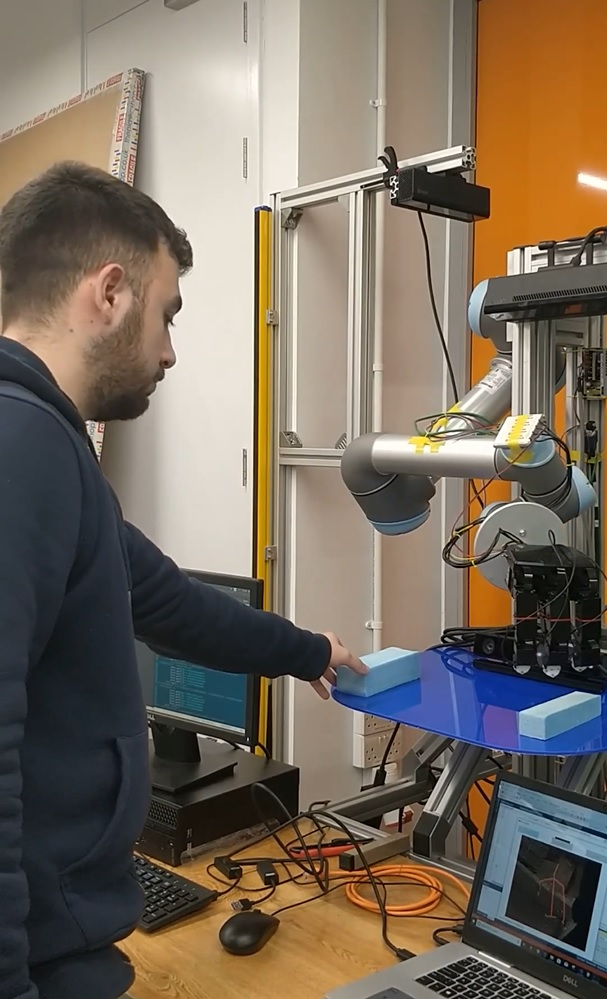
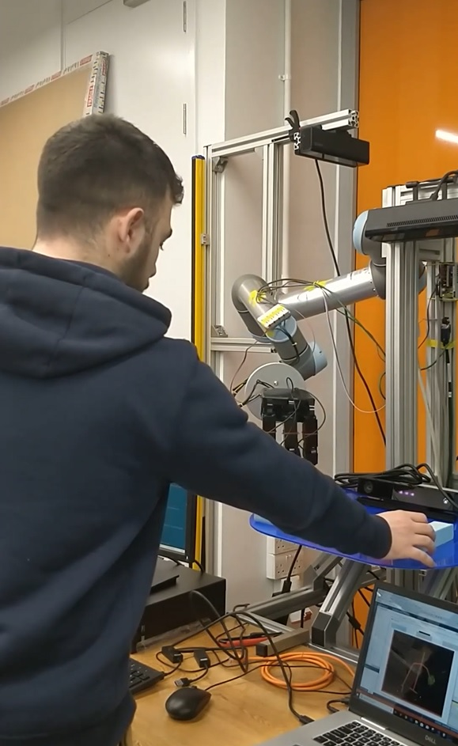
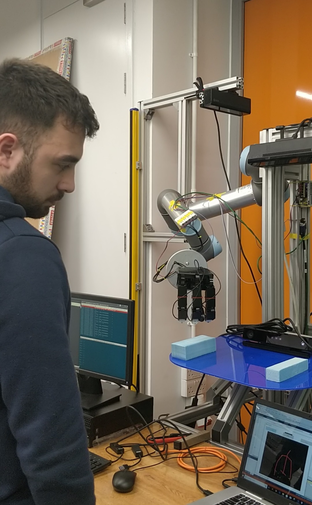

# Robot Anticipation Of Human Actions Using an RGB-D sensor

The project is aimed to allow a robot to anticipate human intentions while interaction partners are still performing their action. Specifically, two actions are anticipated from the UR5 robot. When the human decides for an object to pick and reaches to it, the robot arm must pick the other object. This way, a feeling of cooperation between the interaction partner and the robot will be created.

## Getting Started

One Ubuntu 16.04 LTS machine and a Windows 10 machine is needed.


### Prerequisites

ROS-kinetic: http://wiki.ros.org/kinetic/Installation/Ubuntu  <br/>
Catkin workspace: http://wiki.ros.org/ROS/Tutorials/InstallingandConfiguringROSEnvironment  <br/>
ROS Industrial Universal Robots: https://github.com/ros-industrial/universal_robot <br/>
Visual Studio 2017: https://docs.microsoft.com/en-us/visualstudio/ide/?view=vs-2017 <br/>

### SETUP

1) **Get [ROS kinetic](http://wiki.ros.org/kinetic/Installation/Ubuntu) on Linux 16.04** <br/>

2) **Follow instructions to create [catkin workspace](http://wiki.ros.org/ROS/Tutorials/InstallingandConfiguringROSEnvironment)** <br/>

3) **Install [ROS Industrial Universal Robots](https://github.com/ros-industrial/universal_robot)** <br/>

Open terminal and execute:
```
sudo apt-get install ros-kinetic-universal-robot
```

4) **Download files from my GIT repository** <br/>

File 'listener.py' is needed into the Ubuntu machine inside catkin enviroment, into /src folder. <br/>

'BodyBasics-WPF' folder and files 'new_workspace_2.mat','predmovement.m','predmovement_2.m','workspace_head.mat' need to be to the Windows Machine.
IMPORTANT! make sure '*.m', '*.mat' files are on the same directory.

5) **Download [Visual Studio 2017](https://docs.microsoft.com/en-us/visualstudio/ide/?view=vs-2017) on Windows Machine** <br/>

6) **Connect Xbox Kinect v2 to the Windows Machine using an adaptor** <br/>

7) **On Ubuntu Machine open terminal and run** <br/>
```
hostname -I
```

8) **Go to BodyBasics-WPF folder on Windows** <br/>

Certain changes are needed to use the application. <br/>
Open **MainWindow.xaml.cs** using Visual studio or any other text editor.<br/>
Go to line **200**, change the IP, to the IP of the Ubuntu Machine obtained in step 7. <br/>
Afterwards, go to line **516** and change the path to the directory that the '*.m', '*.mat' files are saved 
 

### TESTING

The application is ready to be simulated using Gazebo simulator. <br/>
**On Ubuntu Machine side:** <br/> 
Make sure for every terminal/shell you are directed to the catkin enviroment. <br/>
Example: <br/>
```
cd catkin_ws
```
and then source the setup file for your shell using the command:
```
source devel/setup.bash
```

1) Open terminal and run Gazebo simulation

```
roslaunch ur_gazebo ur5.launch
```

2) Open new terminal for setting up the MoveIt! nodes to allow motion planning

```
roslaunch ur5_moveit_config ur5_moveit_planning_execution.launch sim:=true
```

3) Open new terminal for starting up RViz with a configuration

```
roslaunch ur5_moveit_config moveit_rviz.launch config:=true
```

4) Open new terminal to run listener node

```
cd src
```
```
python listener.py
```


**On Windows Machine side:** <br/> 

Open the MainWindows.xaml.cs application using Visual Studio 2017 and click start. 


## Photos
The photos were obtained in the Advanced Robotics at Queen Mary using the UR5 robot <br/>





## Video

https://www.youtube.com/watch?v=aitVCOc7kYU


## Author

[Spyridon Couvaras](https://www.linkedin.com/in/spyridon-couvaras-8611a714a/)  <br/>
Email: sv.couvaras@gmail.com

## Acknowledgments

* [Dr Lorenzo Jamone](http://www.eecs.qmul.ac.uk/profiles/jamonelorenzo.html)
* [Mr Gokhan Solak](http://www.eecs.qmul.ac.uk/profiles/solakgokhan.html)
* [Mr Brice Denoun](http://eecs.qmul.ac.uk/profiles/denounbricedavid.html)

